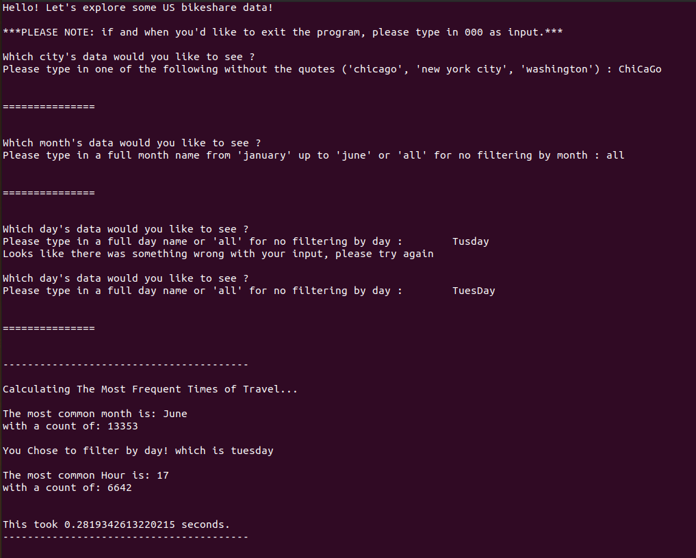
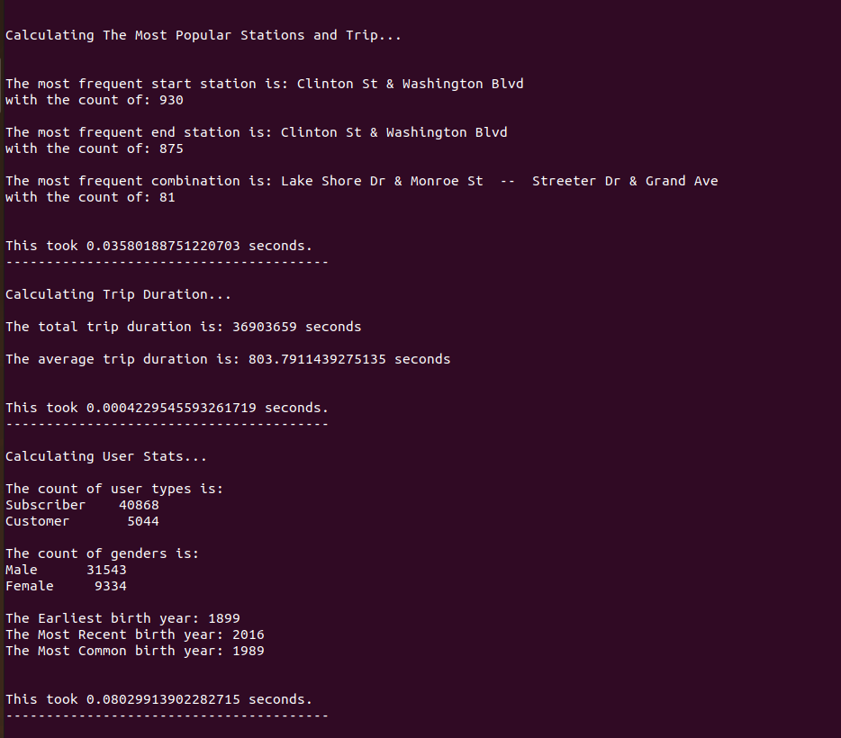
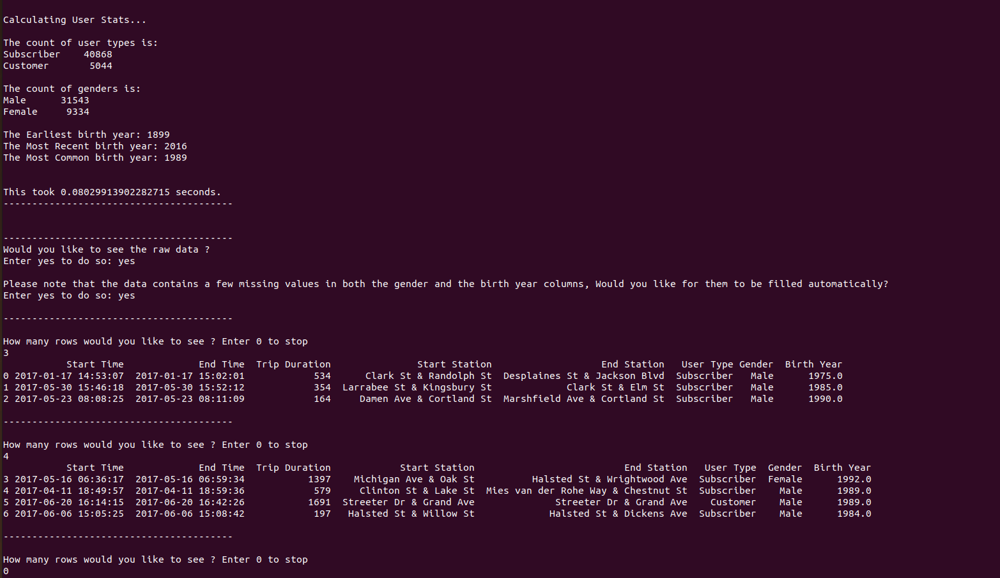
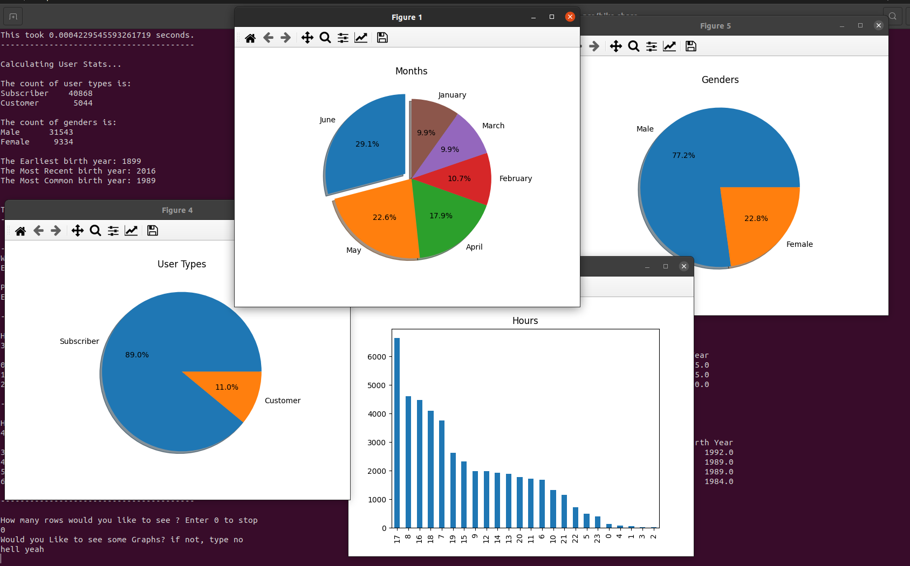

## Bikeshare Data Exploration

### Table of Contents
1. [About](#about)
2. [Usage](#usage)
3. [Execution](#execution)
4. [Screenshots](#screenshots)
5. [Conclusion](#conclusion)

### About

#### Background

This is my submission to the Bikeshare Exploration project in Udacity's Data Analysis Professional Nanodegree.  
if you are currently trying to do the project from Udacity, feel free to check my solution, but please do not copy it :)

#### Description

As a data analyst I was presented with 3 csv files regarding a bikesahre's program data, each file is for a different city.

#### Objective

Create a simple CLI (Command Line Interface) that interacts with the user and shows statistics and insights about the program.

### Usage

If you'd like to try this project you can :

1. download or clone this repo using  
   `git clone https://github.com/KhaledBasiony/Bikeshare_Scripting`  
   or you can just download it from the download button above :D

2. Extract the "bike share.zip" and make sure the contents are in the same directory as the .py file
3. Make sure you have [python](https://www.python.org/downloads/), [pandas](https://pandas.pydata.org/pandas-docs/stable/getting_started/install.html#installing-from-pypi), [numpy](https://numpy.org/install/), and [matplotlib](https://matplotlib.org/stable/users/installing.html) installed.
4. open a command prompt or a terminal, and navigate to the directory containing the files, and run:  
   `python3 bikeshare.py`

5. follow the instructions as requested (try not to make any typos)

### Execution

the code starts by asking you to choose which city's data you'd like to see, which date parameters would you like to filter them by (months and days).

Then it shows some statistics regarding:  
> - most common hour  
> - most common routes  
> - user summary stats  
> - trip duration statistics

Then it asks if you'd like to see some rows of the raw data, type yes if you'd like to take a peek at the data,

And finally give you the option to see some basic charts visualizing some of the mentioned statistics.

### Code

The code uses a functional programming approach, which basically means that every operation has a function that does it.

### Screenshots

Showing user entry and sample output  

> 

Extended output 

> 

Shows rows of Raw data  

> 

Showing visualizations  

> 

### Conclusion

given the screenshots above, we can come to a conclusion that on tuesdays in all months, in the city of chicago
>  - 3PM is the most common hour to rent a bike
>  - majority of users are subscribers
>  - there is approximately 1 female in every 4 people
>  - the most frequent start and stop station is **_Clinton St & Washington Blvd_**
>  - yet the most frequent route is **_Lake Shore Dr & Monroe St_** ==> **_Streeter Dr & Grand Ave_**
>  - the average ride takes around **13** mins

The end :)

